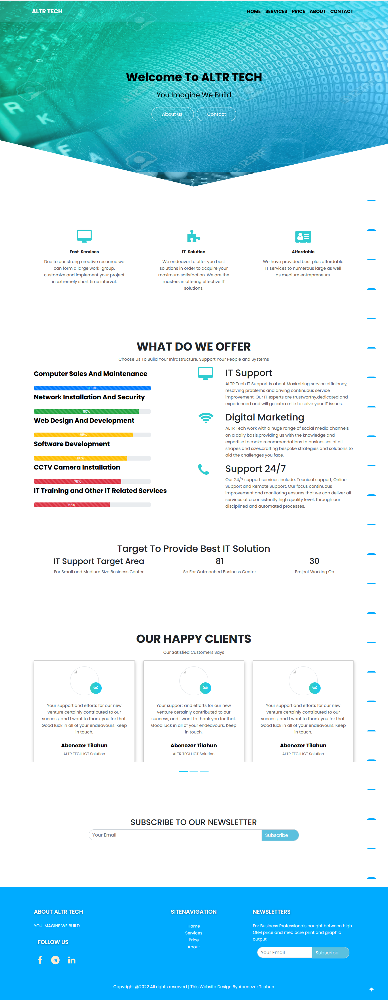

# ALTR-TECH-ICT-Solution

> This is a business  project being built for ICT Solution PLC which provides services and prodcut for customers.

Our goal here is to Build Business based  website where you can get information, services and product provided by the ICT Solution PLC click [here](https://abenezer-tilahun.github.io/ALTR-TECH-ICT-Solution/) to see deployed live version

### Features implemented so far are:

- Responsive UI/UX design with interactive animation
- Integrated webpack

## Built With

- Lighthouse (An open-source, automated tool for improving the quality of web pages. It has audits for performance, accessibility, progressive web apps, SEO and more).
- Webhint (A customizable linting tool that helps you improve your site's accessibility, speed, cross-browser compatibility, and more by checking your code for best practices and common errors).
- Stylelint (A mighty, modern linter that helps you avoid errors and enforce conventions in your styles).
- ESlint (A mighty, modern linter that helps you avoid errors and enforce conventions in JavaScript codes)
- Webpack (Used for bundling JavaScript files for usage in a browser)
- Animate.CSS (A library used for creating interactive UI animations)

To get a local copy up and running follow these simple example steps.

### Prerequisites

The basic requirements for building the executable are:

- A working browser application (Google chrome, Mozilla Fire fox, Microsoft edge ...)
- VSCode or any other equivalent code editor
- Node Package Manager (For installing packages like Lighthous, webhint & stylelint used for checking for debugging bad codes before deployment)

# Getting Started

#### Cloning the project

```
git clone  https://github.com/Abenezer-Tilahun/ALTR-TECH-ICT-Solution.git <Your-Build-Directory>
```

## Getting packages and dependencies
To get all package modules required to build the project run:
```
npm install
```
every package module required to build the project is listed in the package.json file. this is used as a reference to get all dependencies.

## Building 

To build the project run:
```
npm run build
```
after you run this sucessfully you'd locate the build from in the ```dist``` folder located from the parent directory of the project. two files are being built which are, ```main.js and index.html```

## Running

To run the program on a browser through a server run this command in your cli
```
npm start
```
This should open the page in your localhost on port 8080. then you'd be able to view the built page generated using webpack.

## 🤝 Contributing

Feel free to check the [issues page](../../issues/).

## Authors

👤 **Author1**

- GitHub: [@githubhandle](https://github.com/Abenezer-Tilahun)
- Twitter: [@twitterhandle](https://twitter.com/AbenezerTilah11)
- LinkedIn: [LinkedIn](linkedin.com/in/abenezer-tilahun-4b4b43137)


## Show your support

Give a ⭐️ if you like this project!

## Acknowledgments

- Microverse
- My partners

## 📝 License

This project is [MIT](./MIT.md) licensed.